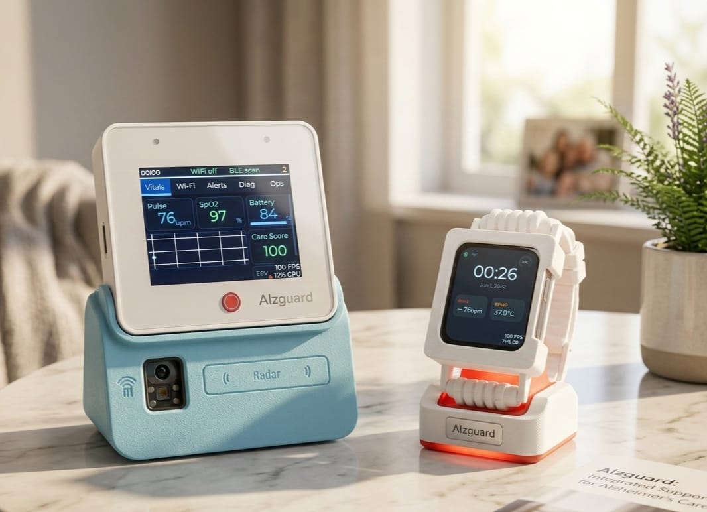
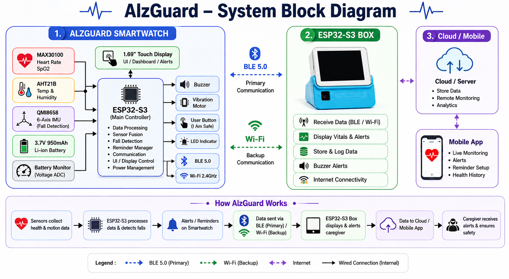

# AlzGuard


AlzGuard is an ESP32-S3 based wearable healthcare monitoring and safety system designed for Alzheimer patient assistance. The project integrates real-time vital monitoring, intelligent fall detection, reminder management, BLE communication, Wi-Fi connectivity, and a caregiver companion device into a single platform.

## Features

### Health Monitoring

- Heart Rate Monitoring (MAX30100)
- Blood Oxygen Monitoring (SpO₂)
- Temperature Monitoring (AHT21B)
- Humidity Monitoring (AHT21B)
- Battery Monitoring

### Safety Features

- Multi-Stage Fall Detection
- Free-Fall Analysis
- Impact Detection
- Stillness Verification
- Emergency Alert Generation
- "I AM SAFE" Confirmation

### Reminder System

- Medication Reminders
- Water Reminders
- Meal Reminders
- Exercise Reminders
- Sleep Reminders
- Custom Reminders
- Persistent Storage using NVS

### Connectivity

- Bluetooth Low Energy (BLE)
- Wi-Fi Communication
- Companion Device Communication
- Mobile Dashboard Integration

### User Interface

- LVGL-based Touch Interface
- Real-Time Dashboard
- Reminder Management
- Device Status Monitoring
- Emergency Alert Screens

## Hardware

### Smartwatch

| Component | Description |
|------------|------------|
| Waveshare ESP32-S3 1.69" Touch Display | Main Controller |
| MAX30100 | Heart Rate and SpO₂ Sensor |
| AHT21B | Temperature and Humidity Sensor |
| QMI8658 IMU | Fall Detection |
| 3.7V 950mAh Li-Ion Battery | Power Source |

### Companion Device

| Component | Description |
|------------|------------|
| ESP32-S3-BOX-3 | Caregiver Monitoring Device |

## Repository Structure

```text
AlzGuard/
├── Firmware/
│   ├── alzguard_main.ino
│   ├── alzguard_types.h
│   ├── battery_monitor.h
│   ├── fall_detector.h
│   ├── reminder_manager.h
│   ├── wifi_manager.h
│   └── ui_main.h
│
├── CAD/
├── Documentation/
├── Images/
└── README.md
```

## Building

### Requirements

- Arduino IDE 2.x
- ESP32 Board Package
- LVGL
- ArduinoJson
- Preferences

### Clone Repository

```bash
git clone https://github.com/<your-username>/AlzGuard.git
```

### Open Project

```text
Firmware/alzguard_main.ino
```

### Build Steps

1. Install required libraries
2. Install ESP32 Board Package
3. Select ESP32-S3 board
4. Compile the project
5. Upload firmware

## Wiring

### MAX30100

| MAX30100 | ESP32-S3 |
|-----------|-----------|
| VCC | 3.3V |
| GND | GND |
| SDA | SDA |
| SCL | SCL |

### AHT21B

| AHT21B | ESP32-S3 |
|---------|---------|
| VCC | 3.3V |
| GND | GND |
| SDA | SDA |
| SCL | SCL |

> Replace SDA and SCL with the actual GPIO pins used in your implementation.

## Images

### Final Prototype



### System Architecture



### User Interface


## License

This project is licensed under the GNU General Public License v3.0 (GPL-3.0).

See the LICENSE file for details.
